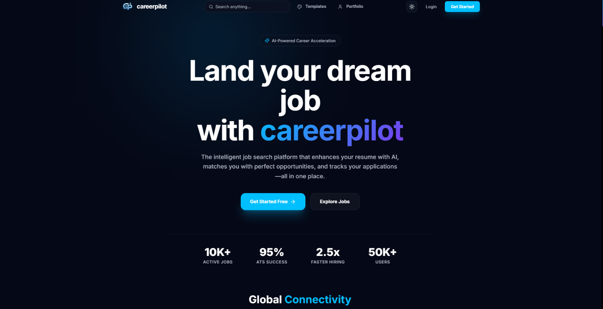

<div align="center">
  
  <br />
  <h1>🌐 Career Pilot</h1>
  <p>
    <strong>An intelligent, AI-powered career platform that revolutionizes the job hunting experience through automated resume enhancement, intelligent job matching, AI mock interviews, corporate fellowships, and community-driven networking.</strong>
  </p>

  <p align="center"> 
    <a href="https://github.com/anurag3407/career-pilot/blob/main/LICENSE">
      
    </a>
    
    
    
    
    
  </p>

  <p align="center">
    <a href="#-features">Features</a> • 
    <a href="#-tech-stack">Tech Stack</a> • 
    <a href="#-getting-started">Getting Started</a> • 
    <a href="#-api-reference">API Reference</a> • 
    <a href="#-contributing">Contributing</a>
  </p>
</div>

<br />

---

## 🌟 Overview

The **AI Resume Builder & Career Platform** is a comprehensive full-stack application designed to streamline and enhance the job search process. By leveraging cutting-edge AI technology (Google Gemini 2.5), real-time communication via Socket.IO, and intelligent automation through BullMQ job queues, this platform provides job seekers with powerful tools to succeed.

---

## 📸 Project Preview

### Home Page



### Resume Enhancement


### Community Platform


### Authentication


### Job Tracker


### Mock Interview


---

## 💡 Our Solution

We solve the modern job seeker's most painful challenges:

<table>
  <tr>
    <td width="50%">
      <h3>💎 Resume Optimization</h3>
      <p>AI-powered resume enhancement using Google Gemini 2.5 with ATS scoring and Harvard-format templates.</p>
    </td>
    <td width="50%">
      <h3>🧊 Information Overload</h3>
      <p>Smart job alerts with customizable filters (keywords, location, salary, employment type) delivered via real-time sockets.</p>
    </td>
  </tr>
  <tr>
    <td width="50%">
      <h3>📈 Application Tracking</h3>
      <p>Visual Kanban-style job tracker with status management from Saved all the way to Offered.</p>
    </td>
    <td width="50%">
      <h3>🌐 Isolation & Networking</h3>
      <p>Real-time community platform with channels, posts, direct messaging, and presence indicators.</p>
    </td>
  </tr>
  <tr>
    <td width="50%">
      <h3>📘 Skill Gaps & Portfolios</h3>
      <p>AI-generated improvement suggestions, LinkedIn optimizations, and a drag-and-drop Portfolio Builder.</p>
    </td>
    <td width="50%">
      <h3>⚡ Time Consumption</h3>
      <p>Automated job fetching, bulk processing via queues, and one-click resume downloads.</p>
    </td>
  </tr>
</table>

---

## ✨ Core Features

<details>
<summary><b>🤖 AI-Powered Resume Enhancement</b></summary>
<br>

- **Smart Resume Enhancement**: Transform ordinary resumes into ATS-optimized documents
- **Professional Summary Generation**: AI-crafted summaries tailored to target roles
- **Improvement Suggestions**: Actionable recommendations to strengthen your resume
- **ATS Score Analysis**: Get compatibility scores with detailed feedback
- **Harvard Template Formatting**: Industry-standard resume formatting
      </details>

<details>
<summary><b>🎓 Career Pilot Fellowships</b></summary>
<br>

- **Corporate Challenges**: Companies post real-world challenges for students
- **Student Proposals**: Students submit proposals with cover letters and pricing
- **Escrow Payments**: Razorpay integration for secure payments until completion
- **Real-time Chat**: Direct messaging between corporate and students
      </details>

<details>
<summary><b>🎤 AI Interview Prep</b></summary>
<br>

- **Mock Interviews**: AI-powered interview simulations
- **Role-Specific Questions**: Tailored questions based on target role
- **Real-time Feedback**: Instant AI evaluation of responses
- **Multi-Round Support**: Technical, behavioral, and HR round simulations
      </details>

<details>
<summary><b>🖼️ Portfolio Builder & GitHub Intelligence</b></summary>
<br>

- **AI Section Enhancement**: Enhance your portfolio's hero, projects, and about sections using Gemini AI
- **LinkedIn Profile Optimizer**: AI-generated headline rewrites and skills gap analysis vs. industry peers
- **Theme Selector**: Choose from multiple portfolio themes to match your personal brand
- **LinkedIn OAuth**: Sign in with LinkedIn and auto-import profile data
      </details>

---

## 🛠 Tech Stack

<table>
  <tr>
    <th>Frontend</th>
    <th>Backend</th>
    <th>Infrastructure</th>
  </tr>
  <tr>
    <td valign="top">
      <ul>
        <li><b>React 19</b></li>
        <li><b>Vite 7</b></li>
        <li><b>TailwindCSS 4</b></li>
        <li><b>Framer Motion</b></li>
        <li><b>Socket.IO Client</b></li>
        <li><b>Zustand</b></li>
      </ul>
    </td>
    <td valign="top">
      <ul>
        <li><b>Node.js 18+</b></li>
        <li><b>Express.js</b></li>
        <li><b>MongoDB + Mongoose</b></li>
        <li><b>BullMQ + IORedis</b></li>
        <li><b>Google Gemini AI</b></li>
        <li><b>Razorpay API</b></li>
      </ul>
    </td>
    <td valign="top">
      <ul>
        <li><b>Firebase Auth</b></li>
        <li><b>MongoDB Atlas</b></li>
        <li><b>Redis</b></li>
        <li><b>RapidAPI (JSearch)</b></li>
        <li><b>Netlify</b></li>
      </ul>
    </td>
  </tr>
</table>

---

## 🚀 Getting Started

### Prerequisites

Before running the project locally, make sure you have:

- Node.js 18+
- MongoDB instance (local or MongoDB Atlas)
- Redis server
- Firebase project configuration
- Google Gemini API key

---

## 📦 Installation

### 1. Clone the Repository

Firstly, clone the repository by clicking green button at GitHub and getting the link or by doing the following in Terminal

```bash
git clone https://github.com/anurag3407/career-pilot.git
cd career-pilot
```

---

### 2. Install Backend Dependencies

Now, In order to install backend dependencies, run the commands written below

```bash
cd backend
npm install
```

---

### 3. Install Frontend Dependencies

For frontend, navigate to frontend and run npm install

```bash
cd ../frontend
npm install
```

---

## ⚙️ Environment Variables

Create a `.env` file inside the `backend` directory and configure:

```env
PORT=5001
MONGODB_URI=your_mongodb_uri
REDIS_HOST=localhost
REDIS_PORT=6379
GEMINI_API_KEY=your_api_key
RAZORPAY_KEY_ID=your_key
RAZORPAY_KEY_SECRET=your_secret
```

You may also need a `.env` file inside the `frontend` directory depending on your local setup.

---

## ▶️ Running the Application

Open two terminals.

### Terminal 1 — Backend

```bash
cd backend
npm run dev
```

Backend runs on:

```text
http://localhost:5001
```

### Terminal 2 — Frontend

```bash
cd frontend
npm run dev
```

After starting both servers:

- Frontend runs on: `http://localhost:5173`
- Backend runs on: `http://localhost:5001`

---

### Verify Installation

After starting both frontend and backend servers:

- Open `http://localhost:5173`
- Verify the frontend loads successfully
- Check backend logs for database/API connection errors
- Ensure Firebase and MongoDB connections initialize correctly

---

## 📜 Available Scripts

### Frontend

```bash
npm run dev
npm run build
npm run lint
```

### Backend

```bash
npm run dev
npm start
```

## 📂 Project Structure & Architecture

<details>
<summary><b>View Directory Structure</b></summary>
<br>

```text
career-pilot/
├── backend/
│   ├── src/
│   │   ├── config/          # Firebase, AI, Socket, DB setup
│   │   ├── controllers/     # Route logic
│   │   ├── middleware/      # Auth, Rate limiting, Uploads
│   │   ├── models/          # Mongoose Schemas (User, Job, Resume)
│   │   ├── routes/          # Express Routers
│   │   └── services/        # BullMQ Queues, Emails, Integrations
├── frontend/
│   ├── src/
│   │   ├── components/      # UI, Community, Portfolio
│   │   ├── context/         # Auth & Socket contexts
│   │   ├── hooks/           # Custom React hooks
│   │   ├── pages/           # Route views
│   │   └── services/        # API and Socket instances
└── firebase/                # Security Rules & Indexes
```

</details>

New contributors should read **[ARCHITECTURE.md](./ARCHITECTURE.md)** early, as it includes high-level system diagrams, data-flow charts, and security notes.

---

## 📖 Developer Guides & Extended Documentation

To help you get familiar with the advanced subsystems of Career Pilot, we have provided detailed technical guides in the `docs` directory:

* 🛠️ **[Environment Setup](./docs/environment-setup.md)**: Standard walkthrough for local environment variables, DB configurations, and cluster parameters.
* 🤖 **[AI Features & Integration](./docs/ai-features.md)**: Deep-dive into Gemini prompt engineering, Harvard resume heuristics, and ATS scoring systems.
* 📦 **[Portfolio Architecture](./docs/portfolio-architecture.md)**: Overview of the dynamic landing page renderer, metadata structures, and theme systems.
* 🎨 **[Creating Portfolio Themes](./docs/creating-portfolio-themes.md)**: Step-by-step developer tutorial on creating custom portfolio aesthetics.
* 🐙 **[GitHub Intelligence](./docs/github-intelligence.md)**: Inside look at how the system crawls repositories, parses metadata, and evaluates developer portfolios.
* ⚡ **[Redis Lifecycle & Connection Tuning](./docs/redis-connection-lifecycle-issue.md)**: Advanced troubleshooting guide for Redis subscription channels and job queues.
* 🌐 **[CDN & Assets Setup](./docs/cdn-setup.md)**: Cloudflare cache settings and optimal static asset delivery.
* 🚀 **[Deployment Setup](./docs/deployment-setup.md)**: Production configurations for Vercel, Netlify, and server hosting.
* 📘 **[User Guide](./docs/user-guide.md)**: Full-featured guide explaining product usage and workflow patterns.

---


## 🔌 API Reference

<details>
<summary><b>View API Routes & Examples</b></summary>
<br>

Most endpoints require a Firebase ID Token passed as an `Authorization` header.

### Authentication

```bash
# Verify Token
GET /api/auth/verify
```

### Resumes & AI

```bash
# Upload PDF
POST /api/upload

# Enhance Resume via Gemini AI
POST /api/enhance
Content-Type: application/json
{
  "resumeText": "...",
  "jobRole": "Frontend Engineer"
}

# ATS Analysis
POST /api/enhance/ats-analysis
```

### Job Tracking & Alerts

```bash
# Create Job Alert
POST /api/job-alerts

# Track Application Pipeline
POST /api/job-tracker
```

For complete documentation, see the [API Reference Guide](./API_DOCS/README.md).

</details>

---

## 🛠️ Troubleshooting Guide

<details>
<summary><b>View Solutions to Common Issues</b></summary>
<br>

### MongoDB Connection Error (`MongoServerSelectionError`)

- Verify your `MONGODB_URI` in backend `.env`
- Ensure MongoDB service is running
- Check IP whitelist if using MongoDB Atlas

### Redis Connection Error (`ECONNREFUSED 127.0.0.1:6379`)

- Ensure Redis server is installed and running
- Verify `REDIS_HOST` and `REDIS_PORT`

### Port Already in Use (`EADDRINUSE`)

- Change the `PORT` value in `.env`
- Stop other Node instances: `killall node` (Mac/Linux)
      </details>

---

## 🤝 Contributing

We welcome contributions! Please see our [CONTRIBUTION.md](./CONTRIBUTION.md) for the Development Setup, Pull Request Process, and Coding Standards.

## 💙 Thank You Contributors

Thank you to all the amazing contributors who have helped improve this project. <br></br>

<a href="https://github.com/anurag3407/career-pilot/graphs/contributors">
  
</a>

Your efforts, pull requests, ideas, and support make this project better every day and help grow an incredible open-source community 🚀

---

## 📄 License

This project is licensed under the MIT License - see the [LICENSE](LICENSE) file for details.

<br />
