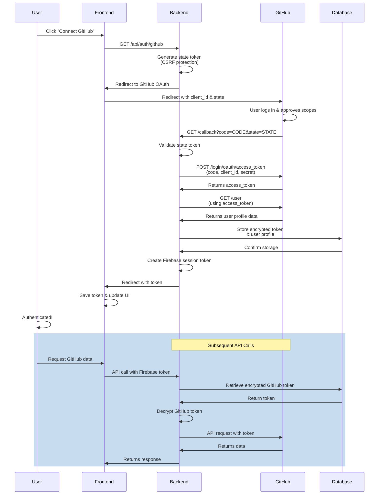

# 🐙 GitHub Intelligence Module

Developer documentation for the GitHub Intelligence subsystem, which provides deep repository analysis, health scoring, technology stack detection, and portfolio integration capabilities.

---

## Table of Contents

1. [OAuth Setup Guide](#oauth-setup-guide)
2. [API Endpoints Reference](#api-endpoints-reference)
3. [Deep Scan Algorithm](#deep-scan-algorithm)
4. [Health Score Criteria](#health-score-criteria-and-weights)
5. [README Asset Engine](#readme-asset-engine-configuration)
6. [Rate Limiting Strategy](#rate-limiting-strategy)
7. [OAuth Flow Diagram](#oauth-flow-sequence-diagram)

---

## OAuth Setup Guide

### Prerequisites

- GitHub Personal Access Token (PAT) or OAuth App registration
- Backend running Node.js with Express
- Firebase for user authentication

### Configuration

#### Environment Variables

Add the following variables to your `.env` file:

```bash
# GitHub OAuth Configuration
GITHUB_OAUTH_CLIENT_ID=your_oauth_client_id_here
GITHUB_OAUTH_CLIENT_SECRET=your_oauth_client_secret_here
GITHUB_OAUTH_REDIRECT_URI=http://localhost:5001/api/auth/github/callback

# GitHub API Configuration
GITHUB_API_TOKEN=your_personal_access_token_here
GITHUB_API_BASE=https://api.github.com
GITHUB_API_VERSION=2022-11-28

# Rate Limiting
GITHUB_API_RATE_LIMIT=5001
GITHUB_API_RATE_WINDOW=3600000
```

### Creating a GitHub OAuth App

1. **Navigate to GitHub Developer Settings**
   - Go to https://github.com/settings/developers
   - Click "OAuth Apps" → "New OAuth App"

2. **Register Application**
   - **Application name**: Career Pilot
   - **Homepage URL**: `https://yourdomain.com`
   - **Authorization callback URL**: `http://localhost:5000/api/auth/github/callback`
   - Click "Register application"

3. **Retrieve Credentials**
   - Copy the **Client ID** → `GITHUB_OAUTH_CLIENT_ID`
   - Generate a **Client Secret** → `GITHUB_OAUTH_CLIENT_SECRET`
   - Store securely in your `.env` file

### Required Scopes

The following OAuth scopes are required for full GitHub Intelligence functionality:

```
repo              # Full control of private repositories
user              # Access to user profile data
read:user         # Read-only user profile
public_repo       # Access to public repositories
workflow          # Access to GitHub Actions workflows
read:org          # Read organization data
```

**Scope String for Authorization:**
```
repo,user,read:user,public_repo,workflow,read:org
```

### State Management for CSRF Protection

All OAuth flows must include state parameter validation:

```javascript
import crypto from 'crypto';

const stateStore = new Map();

// Generate state token (valid for 10 minutes)
const state = crypto.randomBytes(16).toString('hex');
stateStore.set(state, Date.now() + 10 * 60 * 1000);

// Validate state on callback
const storedExpiry = stateStore.get(state);
if (!storedExpiry || Date.now() > storedExpiry) {
  throw new Error('Invalid or expired state token');
}
stateStore.delete(state);
```

### Token Exchange Flow

**Step 1:** Redirect user to GitHub authorization URL

```javascript
export const getGitHubAuthUrl = (state) => {
  const params = new URLSearchParams({
    client_id: process.env.GITHUB_OAUTH_CLIENT_ID,
    redirect_uri: process.env.GITHUB_OAUTH_REDIRECT_URI,
    scope: 'repo,user,read:user,public_repo,workflow,read:org',
    state,
  });
  return `https://github.com/login/oauth/authorize?${params.toString()}`;
};
```

**Step 2:** Exchange authorization code for access token

```javascript
export const exchangeCodeForToken = async (code) => {
  const response = await fetch('https://github.com/login/oauth/access_token', {
    method: 'POST',
    headers: {
      'Accept': 'application/json',
      'Content-Type': 'application/json',
    },
    body: JSON.stringify({
      client_id: process.env.GITHUB_OAUTH_CLIENT_ID,
      client_secret: process.env.GITHUB_OAUTH_CLIENT_SECRET,
      code,
      redirect_uri: process.env.GITHUB_OAUTH_REDIRECT_URI,
    }),
  });

  if (!response.ok) {
    throw new Error(`Token exchange failed: ${response.statusText}`);
  }

  const data = await response.json();
  
  if (data.error) {
    throw new Error(`OAuth error: ${data.error_description}`);
  }

  return {
    accessToken: data.access_token,
    tokenType: data.token_type,
    scope: data.scope,
  };
};
```

**Step 3:** Fetch user profile

```javascript
export const getGitHubProfile = async (accessToken) => {
  const response = await fetch('https://api.github.com/user', {
    headers: {
      'Authorization': `Bearer ${accessToken}`,
      'Accept': 'application/vnd.github+json',
      'X-GitHub-Api-Version': '2022-11-28',
    },
  });

  if (!response.ok) {
    throw new Error(`Failed to fetch profile: ${response.statusText}`);
  }

  const profile = await response.json();
  
  return {
    githubId: profile.id,
    username: profile.login,
    email: profile.email,
    name: profile.name,
    avatar: profile.avatar_url,
    bio: profile.bio,
    company: profile.company,
    location: profile.location,
    publicRepos: profile.public_repos,
    followers: profile.followers,
    following: profile.following,
  };
};
```

### Secure Token Storage

**Never store tokens in plain text!**

```javascript
// Database model for storing encrypted tokens
const UserGitHubToken = mongoose.Schema({
  userId: { type: String, required: true, unique: true },
  encryptedToken: { type: String, required: true },
  tokenHash: { type: String, required: true },
  scopes: [String],
  expiresAt: Date,
  createdAt: { type: Date, default: Date.now },
});

// Encryption utility
import crypto from 'crypto';

const ENCRYPTION_KEY = process.env.GITHUB_TOKEN_ENCRYPTION_KEY;

export const encryptToken = (token) => {
  const iv = crypto.randomBytes(16);
  const cipher = crypto.createCipheriv(
    'aes-256-gcm',
    Buffer.from(ENCRYPTION_KEY, 'hex'),
    iv
  );
  
  let encrypted = cipher.update(token, 'utf8', 'hex');
  encrypted += cipher.final('hex');
  
  const authTag = cipher.getAuthTag();
  
  return `${iv.toString('hex')}:${authTag.toString('hex')}:${encrypted}`;
};

export const decryptToken = (encryptedToken) => {
  const [iv, authTag, encrypted] = encryptedToken.split(':');
  const decipher = crypto.createDecipheriv(
    'aes-256-gcm',
    Buffer.from(ENCRYPTION_KEY, 'hex'),
    Buffer.from(iv, 'hex')
  );
  
  decipher.setAuthTag(Buffer.from(authTag, 'hex'));
  
  let decrypted = decipher.update(encrypted, 'hex', 'utf8');
  decrypted += decipher.final('utf8');
  
  return decrypted;
};
```

---

## API Endpoints Reference

### Base URL
```
http://localhost:5001/api/github
```

### Authentication
All endpoints require `Authorization: Bearer <firebase_id_token>` header unless otherwise noted.

---

### OAuth Endpoints

#### Initiate GitHub OAuth Flow
```http
GET /api/auth/github
```

**Response:** Redirects to GitHub authorization page

**Example:**
```bash
curl http://localhost:5001/api/auth/github
```

---

#### GitHub OAuth Callback
```http
GET /api/auth/github/callback?code=CODE&state=STATE
```

**Parameters:**
- `code` (string): Authorization code from GitHub
- `state` (string): CSRF protection token

**Response:**
```json
{
  "success": true,
  "message": "GitHub authentication successful",
  "user": {
    "uid": "firebase_uid",
    "username": "github_username",
    "avatar": "https://avatars.githubusercontent.com/u/...",
    "email": "user@example.com"
  },
  "token": "firebase_id_token"
}
```

**Errors:**
- `400` - Invalid or expired state token
- `401` - Token exchange failed
- `500` - Profile fetch failed

---

### Repository Analysis Endpoints

#### Analyze Single Repository
```http
POST /api/github/analyze/repo
```

**Headers:**
```
Authorization: Bearer <firebase_id_token>
Content-Type: application/json
```

**Body:**
```json
{
  "owner": "username",
  "repo": "repository-name",
  "includeDeepScan": true,
  "includeCommitHeatmap": true,
  "includeTechStack": true
}
```

**Response:**
```json
{
  "success": true,
  "data": {
    "repository": {
      "id": "12345",
      "name": "repository-name",
      "owner": "username",
      "url": "https://github.com/username/repository-name",
      "description": "Repository description",
      "stars": 150,
      "forks": 45,
      "watchers": 28,
      "language": "JavaScript",
      "topics": ["nodejs", "api", "rest"]
    },
    "health": {
      "score": 78,
      "grade": "B+",
      "components": {
        "documentation": 85,
        "testing": 72,
        "releases": 65,
        "pullRequests": 88,
        "issues": 70,
        "commitFrequency": 92,
        "licensePresence": 100
      }
    },
    "techStack": {
      "languages": ["JavaScript", "HTML", "CSS"],
      "frameworks": ["Express", "React", "Tailwind"],
      "databases": ["MongoDB"],
      "tools": ["Jest", "ESLint", "Webpack"],
      "confidence": 0.92
    },
    "commits": {
      "total": 245,
      "lastWeek": 12,
      "lastMonth": 48,
      "frequency": "active",
      "authors": 5
    },
    "deepScan": {
      "codeQuality": 76,
      "maintainability": 82,
      "securityScore": 71,
      "performanceIndex": 65,
      "issues": [
        {
          "severity": "high",
          "category": "security",
          "description": "Potential SQL injection vulnerability",
          "file": "src/db/queries.js",
          "line": 45
        }
      ]
    }
  }
}
```

**Errors:**
- `400` - Missing required parameters
- `401` - Unauthorized
- `403` - User token lacks required scopes
- `404` - Repository not found
- `429` - Rate limit exceeded

---

#### Analyze Multiple Repositories
```http
POST /api/github/analyze/batch
```

**Body:**
```json
{
  "repositories": [
    { "owner": "user1", "repo": "repo1" },
    { "owner": "user2", "repo": "repo2" }
  ],
  "includeDeepScan": false
}
```

**Response:**
```json
{
  "success": true,
  "data": [
    {
      "repository": { ... },
      "health": { ... }
    }
  ],
  "errors": []
}
```

---

#### Get Repository Health Score
```http
GET /api/github/health/:owner/:repo
```

**Query Parameters:**
- `details` (boolean): Include component breakdown (default: false)

**Response:**
```json
{
  "success": true,
  "data": {
    "owner": "username",
    "repo": "repository-name",
    "healthScore": 78,
    "grade": "B+",
    "lastUpdated": "2026-05-20T10:00:00Z",
    "details": {
      "documentation": 85,
      "testing": 72,
      "releases": 65,
      "pullRequests": 88,
      "issues": 70,
      "commitFrequency": 92,
      "licensePresence": 100
    },
    "trends": {
      "direction": "up",
      "previousScore": 75,
      "change": 3
    }
  }
}
```

---

#### Get Technology Stack
```http
GET /api/github/tech-stack/:owner/:repo
```

**Query Parameters:**
- `precision` (enum): `high`, `standard`, `fast` (default: standard)

**Response:**
```json
{
  "success": true,
  "data": {
    "languages": {
      "JavaScript": { "percentage": 65, "files": 145 },
      "TypeScript": { "percentage": 25, "files": 78 },
      "CSS": { "percentage": 10, "files": 42 }
    },
    "frameworks": [
      { "name": "Express", "confidence": 0.98, "version": "4.18.2" },
      { "name": "React", "confidence": 0.95, "version": "19.0.0" }
    ],
    "databases": [
      { "name": "MongoDB", "confidence": 0.92, "detected": true }
    ],
    "tools": [
      { "name": "Jest", "type": "testing", "confidence": 0.99 },
      { "name": "ESLint", "type": "linting", "confidence": 0.98 }
    ],
    "devDependencies": [...],
    "confidence": 0.94,
    "analysisMethod": "manifest_based"
  }
}
```

---

#### Get Commit Heatmap
```http
GET /api/github/commits/heatmap/:owner/:repo
```

**Query Parameters:**
- `weeks` (number): Number of weeks to display (default: 52)
- `timezone` (string): Timezone for grouping (default: UTC)

**Response:**
```json
{
  "success": true,
  "data": {
    "owner": "username",
    "repo": "repository-name",
    "totalCommits": 245,
    "heatmap": [
      {
        "week": "2026-05-12",
        "days": [
          { "date": "2026-05-12", "commits": 3, "intensity": "low" },
          { "date": "2026-05-13", "commits": 8, "intensity": "medium" },
          { "date": "2026-05-14", "commits": 15, "intensity": "high" }
        ]
      }
    ],
    "contributors": [
      { "login": "developer1", "commits": 120, "percentage": 49 },
      { "login": "developer2", "commits": 85, "percentage": 35 }
    ],
    "mostActiveDay": "Wednesday",
    "mostActiveHour": 14,
    "streak": {
      "currentStreak": 12,
      "longestStreak": 45,
      "lastContribution": "2026-05-20T15:30:00Z"
    }
  }
}
```

---

### Portfolio Integration Endpoints

#### Link GitHub Repository to Portfolio
```http
POST /api/github/portfolio/link
```

**Body:**
```json
{
  "portfolioId": "portfolio_123",
  "owner": "username",
  "repo": "project-name",
  "section": "projects",
  "order": 1
}
```

**Response:**
```json
{
  "success": true,
  "message": "Repository linked to portfolio",
  "data": {
    "linkId": "link_456",
    "portfolioId": "portfolio_123",
    "repository": "username/project-name",
    "linkedAt": "2026-05-20T10:00:00Z"
  }
}
```

---

#### Generate README Assets
```http
POST /api/github/readme/generate
```

**Body:**
```json
{
  "owner": "username",
  "repo": "project-name",
  "assetType": "badge|banner|stats|showcase",
  "theme": "dark|light",
  "includeStats": true
}
```

**Response:**
```json
{
  "success": true,
  "data": {
    "assetType": "badge",
    "markdown": "[](...)",
    "html": "",
    "preview": "https://img.shields.io/badge/..."
  }
}
```

---

## Deep Scan Algorithm

### Overview

The deep scan algorithm provides comprehensive code quality analysis by examining repository structure, code patterns, test coverage, and security vulnerabilities.

### Scan Phases

#### Phase 1: Repository Metadata Collection
```
├─ Fetch repository information
├─ Analyze directory structure
├─ Identify configuration files
├─ Extract package.json data
└─ Calculate repository metrics
```

**Duration:** ~100ms

```javascript
const metadata = {
  structure: {
    totalFiles: 342,
    totalDirectories: 48,
    averageDepth: 3.2,
    largestDirectory: 'node_modules'
  },
  files: {
    sourceFiles: 89,
    configFiles: 12,
    docFiles: 8,
    testFiles: 24
  }
};
```

#### Phase 2: Code Quality Analysis
```
├─ Complexity metrics (cyclomatic, cognitive)
├─ Duplication detection
├─ Dead code identification
├─ Performance antipatterns
└─ Code smell detection
```

**Duration:** ~500ms

```javascript
const codeQuality = {
  averageCyclomaticComplexity: 5.2,
  filesWithHighComplexity: 12,
  duplicationRatio: 0.08,
  maintainabilityIndex: 76,
  deadCode: {
    estimatedLines: 245,
    estimatedPercentage: 2.1
  }
};
```

#### Phase 3: Test Coverage Analysis
```
├─ Detect test frameworks
├─ Analyze test structure
├─ Calculate coverage metrics
├─ Identify untested modules
└─ Review test quality
```

**Duration:** ~300ms

```javascript
const testAnalysis = {
  framework: 'Jest',
  hasTests: true,
  estimatedCoverage: 72,
  testFiles: 24,
  testCases: 128,
  criticalUntested: ['database.js', 'auth.js'],
  quality: {
    averageTestSize: 25,
    duplicateMocks: 3,
    flakiness: 'low'
  }
};
```

#### Phase 4: Dependency Analysis
```
├─ Scan dependencies tree
├─ Identify vulnerabilities
├─ Check outdated packages
├─ Detect unused dependencies
└─ Analyze security risks
```

**Duration:** ~200ms

```javascript
const dependencies = {
  direct: 15,
  transitive: 248,
  outdated: 3,
  vulnerabilities: {
    critical: 0,
    high: 1,
    medium: 2,
    low: 4
  },
  unused: ['chalk@4.1.0'],
  licenseIssues: []
};
```

#### Phase 5: Security Scanning
```
├─ SAST (Static Application Security Testing)
├─ Dependency scanning
├─ Secret detection
├─ Permission analysis
└─ Environment configuration review
```

**Duration:** ~400ms

```javascript
const securityScan = {
  secretsDetected: 0,
  sastIssues: [
    {
      type: 'sql_injection',
      severity: 'high',
      file: 'src/db/user.js',
      line: 42
    }
  ],
  insecurePatterns: [],
  hardcodedCredentials: [],
  exposedEndpoints: []
};
```

#### Phase 6: Documentation Quality
```
├─ Analyze README completeness
├─ Check API documentation
├─ Verify CONTRIBUTING guidelines
├─ Review CHANGELOG
└─ Inspect inline code comments
```

**Duration:** ~150ms

```javascript
const documentation = {
  readmeExists: true,
  readmeCompleteness: 85,
  apiDocumented: true,
  contributeGuideExists: true,
  changelogExists: true,
  commentDensity: 0.12,
  issues: [
    'Missing architecture documentation',
    'API endpoint examples incomplete'
  ]
};
```

### Aggregation and Scoring

Results from all phases are aggregated into component scores:

```javascript
const deepScanResults = {
  codeQuality: {
    score: 76,
    components: {
      complexity: 75,
      duplication: 82,
      maintainability: 76,
      deadCode: 70
    }
  },
  testing: {
    score: 72,
    coverage: 72,
    quality: 75
  },
  security: {
    score: 71,
    dependencies: 68,
    secrets: 100,
    sast: 45
  },
  documentation: {
    score: 85,
    readme: 85,
    api: 80,
    comments: 70
  },
  overallScore: 76
};
```

### Algorithm Complexity

- **Time Complexity:** O(n) where n = number of files
- **Space Complexity:** O(n) for storing analysis results
- **Optimization:** Results cached for 24 hours

---

## Health Score Criteria and Weights

### Component Breakdown

The repository health score combines seven weighted components:

| Component | Weight | Range | Calculation |
|-----------|--------|-------|-------------|
| **Documentation** | 15% | 0-100 | README, API docs, comments |
| **Testing** | 20% | 0-100 | Test coverage, test count, quality |
| **Releases** | 10% | 0-100 | Release frequency, changelog |
| **Pull Requests** | 15% | 0-100 | Review quality, merge time |
| **Issues** | 10% | 0-100 | Response time, resolution rate |
| **Commit Frequency** | 15% | 0-100 | Commits/week, consistency |
| **License** | 5% | 0-100 | License presence, type |
| **Security** | 10% | 0-100 | Vulnerabilities, scan results |

### Scoring Formula

```
Health Score = Σ(component_score × weight)

Total Weight = 100%

Example:
= (85 × 0.15) + (72 × 0.20) + (65 × 0.10) + (88 × 0.15) + (70 × 0.10) + (92 × 0.15) + (100 × 0.05) + (71 × 0.10)
= 12.75 + 14.4 + 6.5 + 13.2 + 7 + 13.8 + 5 + 7.1
= 79.75 → Grade: A-
```

### Component Details

#### 1. Documentation (Weight: 15%)

**Scoring Criteria:**

| Metric | Points |
|--------|--------|
| README.md exists | 25 |
| README ≥ 500 chars | 15 |
| README has examples | 15 |
| API documentation | 15 |
| Contributing guide | 15 |
| Inline code comments | 10 |
| Architecture docs | 5 |

**Calculation:**
```javascript
doc_score = (readmeExists * 25 + readmeLength * 15 + 
             hasExamples * 15 + hasApiDocs * 15 + 
             hasContribGuide * 15 + commentDensity * 10 + 
             hasArchDocs * 5) / 100;
```

#### 2. Testing (Weight: 20%)

**Scoring Criteria:**

| Metric | Points | Formula |
|--------|--------|---------|
| Test coverage | 40 | coverage_percentage |
| Test count | 30 | min(test_count / 50, 30) |
| Test quality | 20 | failed_tests_ratio × 20 |
| CI/CD pipeline | 10 | has_ci_cd × 10 |

**Calculation:**
```javascript
test_score = (
  (coverage_percentage * 0.40) +
  (Math.min(test_count / 50, 1) * 30) +
  ((1 - failed_ratio) * 20) +
  (has_ci * 10)
) / 100;
```

#### 3. Releases (Weight: 10%)

**Scoring Criteria:**

| Metric | Points |
|--------|--------|
| Has releases | 20 |
| Release frequency ≥ 1/month | 30 |
| Semantic versioning | 20 |
| Changelog exists | 20 |
| Pre-release tags | 10 |

**Calculation:**
```javascript
release_score = (
  (hasReleases * 20) +
  (releaseFrequency * 30) +
  (usesSemver * 20) +
  (hasChangelog * 20) +
  (hasPrerelease * 10)
) / 100;
```

#### 4. Pull Requests (Weight: 15%)

**Scoring Criteria:**

| Metric | Points |
|--------|--------|
| Has PR template | 15 |
| Average review time < 24h | 30 |
| Approvals required | 20 |
| Automerge enabled | 15 |
| PR quality | 20 |

**Calculation:**
```javascript
pr_score = (
  (hasPRTemplate * 15) +
  (reviewTimeQuality * 30) +
  (requiresApproval * 20) +
  (hasAutomerge * 15) +
  (prQuality * 20)
) / 100;
```

#### 5. Issues (Weight: 10%)

**Scoring Criteria:**

| Metric | Points |
|--------|--------|
| Has issue template | 15 |
| Avg response time < 48h | 30 |
| Issue resolution rate | 35 |
| No stale issues | 20 |

**Calculation:**
```javascript
issue_score = (
  (hasIssueTemplate * 15) +
  (responseTimeQuality * 30) +
  (resolutionRate * 35) +
  (stalledIssuesPenalty * 20)
) / 100;
```

#### 6. Commit Frequency (Weight: 15%)

**Scoring Criteria:**

| Metric | Points | Threshold |
|--------|--------|-----------|
| Commits/week | 40 | ≥ 5 = 40pts |
| Consistency | 30 | coefficient of variance |
| Author count | 20 | ≥ 3 authors = 20pts |
| Recency | 10 | last commit < 1 week |

**Calculation:**
```javascript
commit_score = (
  (Math.min(commits_per_week, 5) / 5 * 40) +
  (consistency_coefficient * 30) +
  (Math.min(author_count, 3) / 3 * 20) +
  (isRecent ? 10 : 0)
) / 100;
```

#### 7. License (Weight: 5%)

**Scoring Criteria:**

| Condition | Points |
|-----------|--------|
| License exists | 50 |
| Recognized OSS license | 30 |
| Clear license text | 20 |

**Calculation:**
```javascript
license_score = (
  (hasLicense * 50) +
  (isOSSLicense * 30) +
  (hasClearLicense * 20)
) / 100;
```

#### 8. Security (Weight: 10%)

**Scoring Criteria:**

| Issue Type | Penalty |
|-----------|---------|
| Critical vulnerability | -30 |
| High severity | -15 |
| Medium severity | -5 |
| Low severity | -2 |
| Outdated dependency | -1 |

**Calculation:**
```javascript
security_score = Math.max(0, 100 -
  (critical_count * 30) -
  (high_count * 15) -
  (medium_count * 5) -
  (low_count * 2) -
  (outdated_count * 1)
);
```

### Grade Mapping

```
Score Range | Grade | Quality Level
100-95      | A+    | Excellent
94-90       | A     | Excellent
89-85       | A-    | Very Good
84-80       | B+    | Good
79-75       | B     | Good
74-70       | B-    | Fair
69-65       | C+    | Fair
64-60       | C     | Fair
59-55       | C-    | Needs Improvement
< 55        | F     | Poor
```

### Real-time Updates

Health scores are cached for efficiency but updated when:
- New releases are published
- Test results are pushed
- Dependencies are updated
- 24 hours have elapsed (TTL)

---

## README Asset Engine Configuration

### Overview

The README Asset Engine generates dynamic badges, banners, and statistics for repository README files.

### Configuration Schema

```javascript
const readmeEngineConfig = {
  // Badge configuration
  badges: {
    enabled: true,
    style: 'flat-square|flat|plastic|for-the-badge',
    logoWidth: 20,
    color: 'auto|#hexcolor',
    labelColor: '#555',
    link: true,
    cacheTime: 3600
  },

  // Statistics configuration
  stats: {
    enabled: true,
    includeLanguages: true,
    includeContributors: true,
    includeCommits: true,
    includeStars: true,
    timeRange: '30days|90days|all',
    refreshInterval: 86400
  },

  // Banner configuration
  banner: {
    enabled: true,
    height: 120,
    width: 'auto',
    theme: 'dark|light|gradient',
    includeQR: false,
    animationEnabled: false
  },

  // Showcase configuration
  showcase: {
    enabled: true,
    maxProjects: 6,
    displayMetrics: true,
    cardStyle: 'minimal|detailed|grid',
    sortBy: 'stars|recent|contributed'
  }
};
```

### Asset Types

#### 1. Badges

**Health Score Badge:**
```markdown
[](https://career-pilot.dev/health)
```

**Language Badge:**
```markdown
[](...)
```

**Test Coverage Badge:**
```markdown
[](...)
```

**Generated HTML:**
```html

```

#### 2. Statistics Cards

**Configuration:**
```javascript
const statsConfig = {
  type: 'stats',
  theme: 'dark',
  metrics: [
    { label: 'Stars', value: 245, icon: 'star' },
    { label: 'Forks', value: 45, icon: 'fork' },
    { label: 'Contributors', value: 12, icon: 'users' },
    { label: 'Commits', value: 1200, icon: 'git' }
  ]
};
```

**Generated Markdown:**
```markdown
## 📊 Repository Stats

| Metric | Value |
|--------|-------|
| ⭐ Stars | 245 |
| 🍴 Forks | 45 |
| 👥 Contributors | 12 |
| 📝 Commits | 1,200 |
```

#### 3. Language Distribution

**Configuration:**
```javascript
const languageConfig = {
  type: 'languages',
  showPercentage: true,
  maxLanguages: 5,
  sortBy: 'percentage'
};
```

**Generated Output:**
```
📝 Languages
├─ JavaScript: 65% (234 files)
├─ TypeScript: 25% (89 files)
├─ CSS: 7% (30 files)
└─ JSON: 3% (12 files)
```

#### 4. Contributor Showcase

**Configuration:**
```javascript
const contributorConfig = {
  type: 'contributors',
  maxContributors: 6,
  sortBy: 'commits',
  showAvatars: true,
  showCommitCount: true
};
```

**Generated Markdown:**
```markdown
## 👥 Top Contributors

<table>
  <tr>
    <td align="center">
      <a href="https://github.com/user1">
        
        <br />
        <sub><b>Developer 1</b></sub>
        <br />
        <sub>245 commits</sub>
      </a>
    </td>
    ...
  </tr>
</table>
```

### API Implementation

```javascript
// Generate README assets
router.post('/readme/generate', verifyToken, asyncHandler(async (req, res) => {
  const { owner, repo, assetType, config } = req.body;

  // Validate inputs
  if (!owner || !repo || !assetType) {
    throw new ApiError(400, 'Missing required fields');
  }

  // Fetch repository data
  const repoData = await fetchGitHubRepo(owner, repo);
  
  // Generate asset
  const asset = await generateReadmeAsset(assetType, repoData, config);
  
  // Return asset
  res.json({
    success: true,
    data: {
      markdown: asset.markdown,
      html: asset.html,
      preview: asset.previewUrl,
      copyable: asset.markdown
    }
  });
}));
```

### Asset Caching

```javascript
const cacheKey = `readme_asset:${owner}/${repo}:${assetType}`;

const cachedAsset = await redisClient.get(cacheKey);
if (cachedAsset) {
  return JSON.parse(cachedAsset);
}

const asset = await generateAsset(...);
await redisClient.setex(cacheKey, 3600, JSON.stringify(asset));
return asset;
```

---

## Rate Limiting Strategy

### Overview

Rate limiting protects the GitHub Intelligence module from abuse and ensures fair API usage across all users.

### Rate Limit Tiers

```javascript
const rateLimitConfig = {
  // Anonymous users
  anonymous: {
    requests: 60,
    window: 3600,        // 1 hour
    burstSize: 10,
    endpoints: ['GET /health/:owner/:repo']
  },

  // Authenticated users (Free tier)
  authenticated: {
    requests: 1000,
    window: 3600,
    burstSize: 50,
    endpoints: ['*'],
    dailyLimit: 10000
  },

  // OAuth connected users (Standard tier)
  oauthConnected: {
    requests: 5000,
    window: 3600,
    burstSize: 200,
    dailyLimit: 50000,
    monthlyLimit: 1000000
  },

  // Deep scan operations (separate tier)
  deepScan: {
    requests: 20,
    window: 3600,
    costPerRequest: 50     // Uses 50 points per request
  },

  // Batch operations (separate tier)
  batch: {
    requests: 5,
    window: 3600,
    costPerItem: 10,
    maxItemsPerRequest: 100
  }
};
```

### Implementation Strategy

#### 1. Token Bucket Algorithm

```javascript
import RedisRateLimiter from 'express-rate-limit';
import RedisStore from 'rate-limit-redis';
import redis from 'redis';

const redisClient = redis.createClient();

const limiter = new RedisRateLimiter({
  store: new RedisStore({
    client: redisClient,
    prefix: 'rate_limit:',
    expiry: 3600
  }),
  windowMs: 3600 * 1000,        // 1 hour
  max: 1000,                     // 1000 requests per hour
  message: 'Too many requests, please try again later',
  standardHeaders: true,
  legacyHeaders: false,
  skip: (req) => {
    // Skip rate limiting for health check endpoint
    return req.path === '/health';
  },
  handler: (req, res) => {
    res.status(429).json({
      success: false,
      error: 'Rate limit exceeded',
      retryAfter: req.rateLimit.resetTime
    });
  }
});

app.use('/api/github/', limiter);
```

#### 2. Adaptive Rate Limiting

```javascript
const adaptiveRateLimiter = (req, res, next) => {
  const userId = req.user.uid;
  const endpoint = req.path;
  
  // Determine user tier
  const tier = getTierForUser(userId);
  const config = rateLimitConfig[tier];
  
  // Get current usage
  const key = `usage:${userId}:${endpoint}`;
  const usage = redisClient.get(key) || 0;
  
  if (usage >= config.requests) {
    return res.status(429).json({
      success: false,
      error: 'Rate limit exceeded',
      limit: config.requests,
      window: config.window,
      resetTime: Math.ceil(config.window / 1000)
    });
  }
  
  // Increment counter
  redisClient.incr(key);
  redisClient.expire(key, config.window);
  
  // Set response headers
  res.set({
    'X-RateLimit-Limit': config.requests,
    'X-RateLimit-Remaining': config.requests - usage - 1,
    'X-RateLimit-Reset': Math.floor(Date.now() / 1000) + config.window
  });
  
  next();
};
```

#### 3. Quota Management

```javascript
const quotaMiddleware = asyncHandler(async (req, res, next) => {
  const userId = req.user.uid;
  const tier = await getUserTier(userId);
  
  // Check daily quota
  const dailyKey = `quota:daily:${userId}:${getDate()}`;
  const dailyUsage = await redisClient.incr(dailyKey);
  
  if (dailyUsage > tier.dailyLimit) {
    return res.status(429).json({
      success: false,
      error: 'Daily quota exceeded',
      limit: tier.dailyLimit,
      used: dailyUsage,
      resetTime: getNextDayStart()
    });
  }
  
  // Set expiry to end of day
  await redisClient.expireAt(dailyKey, getEndOfDayTimestamp());
  
  // Add quota info to request
  req.quota = {
    tier,
    dailyUsed: dailyUsage,
    dailyRemaining: tier.dailyLimit - dailyUsage
  };
  
  next();
});
```

### Rate Limit Response Headers

All responses include rate limit information:

```http
HTTP/1.1 200 OK

X-RateLimit-Limit: 1000
X-RateLimit-Remaining: 987
X-RateLimit-Reset: 1653036000
X-RateLimit-WindowMs: 3600

RateLimit-Limit: 1000
RateLimit-Remaining: 987
RateLimit-Reset: 1653036000
```

### Cost-Based Limiting

High-cost operations consume more quota:

```javascript
const operationCosts = {
  'GET /health/:owner/:repo': 1,
  'GET /tech-stack/:owner/:repo': 1,
  'POST /analyze/repo': 50,           // Deep scan
  'POST /analyze/batch': (itemCount) => itemCount * 10,
  'POST /readme/generate': 5
};

const costMiddleware = (req, res, next) => {
  const cost = getOperationCost(req);
  
  const key = `cost:${userId}:${window}`;
  const currentCost = redisClient.incrby(key, cost);
  
  if (currentCost > config.costLimit) {
    return res.status(429).json({
      success: false,
      error: 'Operation cost quota exceeded',
      cost: cost,
      available: config.costLimit - currentCost
    });
  }
  
  next();
};
```

### Retry Strategy (Client-Side)

```javascript
export const withRetry = async (fn, maxRetries = 3) => {
  for (let attempt = 1; attempt <= maxRetries; attempt++) {
    try {
      return await fn();
    } catch (error) {
      if (error.status === 429 && attempt < maxRetries) {
        const retryAfter = parseInt(error.headers['retry-after'] || '60');
        await delay(retryAfter * 1000);
        continue;
      }
      throw error;
    }
  }
};

// Usage
const data = await withRetry(async () => {
  return await githubApi.analyzeRepository(owner, repo);
});
```

### Monitoring and Alerts

```javascript
// Log rate limit violations
const rateLimitMonitor = (req, res, next) => {
  if (res.status === 429) {
    logger.warn('Rate limit exceeded', {
      userId: req.user.uid,
      endpoint: req.path,
      tier: req.user.tier,
      timestamp: new Date()
    });
    
    // Alert if excessive violations
    const violationKey = `violations:${userId}`;
    const violationCount = redisClient.incr(violationKey);
    
    if (violationCount > 10 && isWithinOneHour(violationKey)) {
      alertAdmin(`User ${userId} has ${violationCount} rate limit violations`);
    }
  }
  next();
};
```

---

## OAuth Flow Sequence Diagram



### Flow Explanation

1. **Initialization**: User clicks "Connect GitHub" button
2. **State Generation**: Backend generates cryptographically secure state token (valid 10 minutes)
3. **User Authorization**: User is redirected to GitHub authorization page
4. **User Consent**: GitHub displays requested scopes (repo, user, public_repo, etc.)
5. **Authorization Code**: GitHub redirects back with authorization code and state
6. **State Validation**: Backend validates state to prevent CSRF attacks
7. **Token Exchange**: Backend exchanges authorization code for access token
8. **Profile Fetch**: Backend fetches user profile using access token
9. **Data Storage**: Encrypted token and profile data stored in database
10. **Session Creation**: Firebase session token created for user
11. **Redirect**: User redirected to dashboard with authenticated session
12. **API Calls**: Subsequent API calls use stored (decrypted) GitHub token

### Error Scenarios

#### Invalid State Token
```
Frontend ← Backend: error=invalid_state
Frontend: "Authorization failed. Please try again."
```

#### Code Exchange Failure
```
Frontend ← Backend: error=token_exchange_failed
Frontend: "Failed to connect to GitHub. Please try again."
```

#### Permission Denied
```
Frontend ← Backend: error=github_denied
Frontend: "GitHub authorization was denied. Please grant permissions to continue."
```

#### Network Error
```
Frontend ← Backend: error=network_error (500)
Frontend: "Connection error. Please check your internet and try again."
```

---

## Best Practices

### Security

- ✅ Never store unencrypted GitHub tokens
- ✅ Always validate state tokens (CSRF protection)
- ✅ Use HTTPS for all OAuth redirects
- ✅ Implement token expiration and refresh
- ✅ Rotate encryption keys regularly
- ✅ Audit token access in logs
- ✅ Use principle of least privilege for scopes

### Performance

- ✅ Cache health scores for 24 hours
- ✅ Implement batch operations for bulk analysis
- ✅ Use async processing for deep scans
- ✅ Paginate API responses
- ✅ Compress JSON responses with gzip

### Monitoring

- ✅ Log all OAuth token exchanges
- ✅ Monitor rate limit violations
- ✅ Alert on unusual activity
- ✅ Track deep scan completion times
- ✅ Monitor GitHub API errors and outages

### Testing

- ✅ Use test GitHub OAuth credentials in development
- ✅ Mock GitHub API responses in unit tests
- ✅ Test CSRF token validation
- ✅ Test error scenarios (invalid code, expired state)
- ✅ Load test rate limiting

---

## Troubleshooting

### Common Issues

**Issue**: "Invalid state token"
- **Cause**: State token expired (> 10 minutes) or already used
- **Solution**: Restart OAuth flow, clear browser cache

**Issue**: "Token exchange failed"
- **Cause**: Wrong client ID/secret or network error
- **Solution**: Verify credentials in `.env`, check GitHub API status

**Issue**: "Profile fetch failed"
- **Cause**: Missing user scope or API error
- **Solution**: Check OAuth scopes, verify API token, retry

**Issue**: "Rate limit exceeded"
- **Cause**: Too many API requests in time window
- **Solution**: Implement exponential backoff, upgrade tier, wait for window reset

---

## References

- [GitHub OAuth Documentation](https://docs.github.com/en/developers/apps)
- [GitHub REST API Docs](https://docs.github.com/en/rest)
- [Rate Limiting Best Practices](https://developer.github.com/v3/#rate-limiting)
- [OAuth 2.0 RFC 6749](https://tools.ietf.org/html/rfc6749)

---

**Last Updated**: May 20, 2026  
**Version**: 1.0.0  
**Maintainer**: Career Pilot Team
